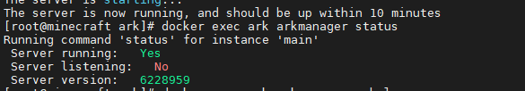

# ARK-Server
How to Install a ARK-Server with Docker on Linux

## First Read the Documentation of the ARK Docker and the Server-Tools

## Recommended Usage
- First run  
 `docker run -it -p 7778:7778 -p 7778:7778/udp -p 27015:27015 -p 27015:27015/udp -p 32330:32330 -e SESSIONNAME=myserver -e ADMINPASSWORD="mypasswordadmin" -e AUTOUPDATE=120 -e AUTOBACKUP=60 -e WARNMINUTE=30 -v /my/path/to/ark:/ark --name ark turzam/ark`  
- Wait for ark to be downloaded installed and launched, then Ctrl+C to stop the server.
- Edit */my/path/to/ark/GameUserSetting.ini and Game.ini*
- Edit */my/path/to/ark/arkserver.cfg* to add mods and configure warning time.
- Add auto update every day and autobackup by editing */my/path/to/ark/crontab* with this lines :  
`0 0 * * * arkmanager update --warn --update-mods >> /ark/log/crontab.log 2>&1`  
`0 0 * * * arkmanager backup >> /ark/log/crontab.log 2>&1`  
- `docker start ark`
- Check your server with :  
 `docker exec ark arkmanager status` 

--- 
## Next step is to get the ARK-Server status

Your output can look like this

If it says that is running but not online it is still working

---

## Usage

You can check your server with :  
`docker exec ark arkmanager status` 

You can manually update your mods:  
`docker exec ark arkmanager update --update-mods` 

You can manually update your server:  
`docker exec ark arkmanager update --force` 

You can force save your server :  
`docker exec ark arkmanager saveworld` 

You can backup your server :  
`docker exec ark arkmanager backup` 

You can upgrade Ark Server Tools :  
`docker exec ark arkmanager upgrade-tools` 

You can use rcon command via docker :  
`docker exec ark arkmanager rconcmd ListPlayers`  
*Full list of available command [here](http://steamcommunity.com/sharedfiles/filedetails/?id=454529617&searchtext=admin)*

---

Now you Ark-Server ist working

If you have any issues with the arkmanager version 1.5 click here: [Arkmanager workaround](./arkmanagerworkaround)

Tutorial done with ARK Docker Version: 1.3

Documentation of ARK Docker: <https://github.com/TuRz4m/Ark-docker> 
Documentation of ARK Server-Tools: <https://github.com/arkmanager/ark-server-tools>