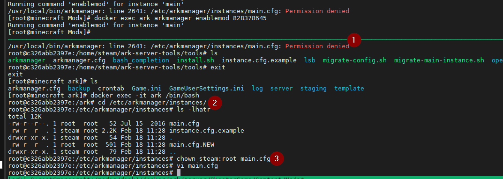

# Arkmanager workaround

## First: Connect to a bash shell on your docker image

```
docker exec -it dockername /bin/bash
```

## Next step is to navigate to existing ark manager location
```
cd /home/steam/ark-server-tools
```

## Update it to the a version you want from git

```
git fetch --all

git checkout v1.6.42
```

## Reinstall Ark Manager
```
cd /home/steam/ark-server-tools/tools
./install.sh steam
```

## You need to chown main.cfg to install mods

```
cd /etc/arkmanager/instances
chown steam:root main.cfg
```


I upgraded the tools to v1.6.42 and after that i did have the possibility to install mods via the arkmanager.

The chown i did for my own because i cann´t install mods because i did not have permissions on the main.cfg.

If i find more bugs i will append this documentation for the bugs i found.

Thanks to this article: <https://github.com/TuRz4m/Ark-docker/issues/28>